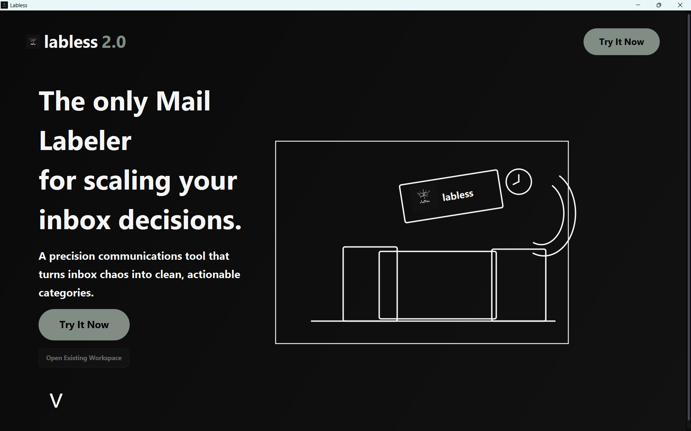
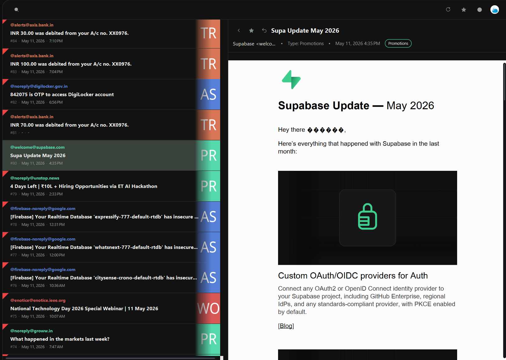
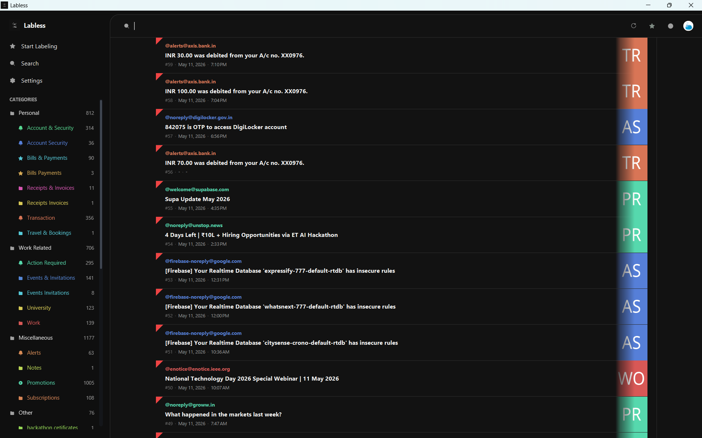
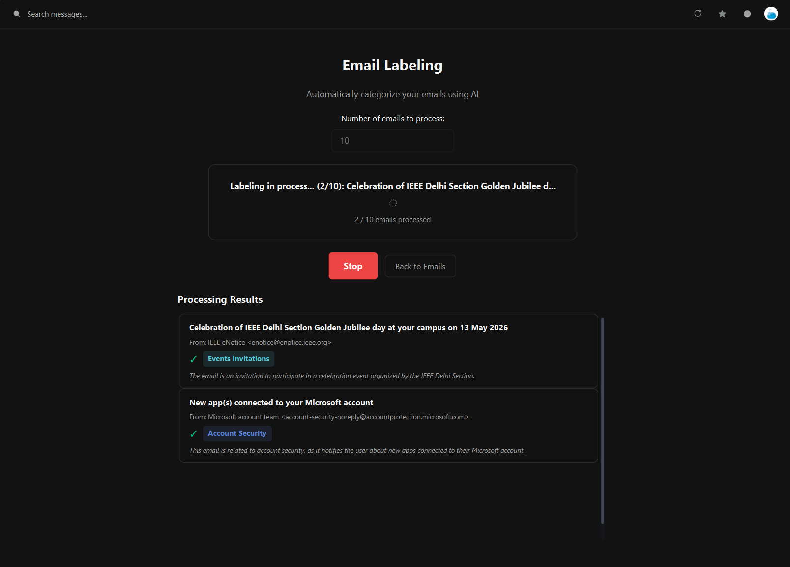

<!-- PROJECT IMAGE / BANNER -->
<p align="center">
  
</p>

# 🚀 Labless (Java GUI)

> Premium JavaFX desktop client for the Labless ecosystem, providing a high-performance, visual interface for AI-powered email organization.

---

## 📖 Description

The Labless Java GUI is the flagship interface for the Labless project. It combines the power of Java 17+ and JavaFX to deliver a smooth, interactive experience. Designed with a focus on usability, it allows users to manage their Gmail inbox using state-of-the-art AI models with zero command-line knowledge required.

What makes it unique:
- **Beautiful UI** – Custom CSS-driven dark mode with glassmorphism elements.
- **Embedded JRE** – Runs as a standalone `.exe` without requiring Java installation.
- **Direct Gmail Integration** – Uses official Google OAuth2 for maximum security.
- **Visual Progress Tracking** – Watch AI process your emails with real-time charts and logs.
- **Configurable LLMs** – Hot-swap between Groq, OpenAI, and local mock services.

---

## ✨ Features

- **OAuth2 Onboarding** – Securely link your Gmail account with one click.
- **Smart Workspace** – Multi-column layout for easy navigation of your inbox.
- **Batch Processing** – Label thousands of emails in minutes using Groq's high-speed API.
- **Custom Categorization** – Define your own labels and let the AI learn your preferences.
- **Local SQLite Storage** – Caches your inbox data locally for lightning-fast browsing.
- **Auto-Installation** – Register the app in Windows Settings for easy management.

<p align="center">
  
  
</p>

---

## 🧠 Tech Stack

**Frontend & Core**
- Java 17+
- JavaFX 21 (Graphics, Controls, FXML)
- CSS3 (Custom Styling)

**Integrations**
- Google Gmail API v1
- Google OAuth2 Client
- Jackson / SnakeYAML (Config)

**Data & Build**
- SQLite (via JDBC)
- Maven
- jpackage / WiX Toolset

---

## 🏗️ Architecture / Workflow

```text
Main Application → Onboarding (OAuth) → Workspace → Processor Service → LLM API → Database Update
```

---

## ⚙️ Installation & Setup

```bash
# Navigate to the GUI project
cd java-gui-mail-labeler

# Ensure you have Maven installed
mvn clean compile

# Run the application
mvn javafx:run
```

*Note: For a production build, use the `build-release.ps1` script in the root directory.*

---

## 🔐 Configuration

Create `config/app-config.yaml` from the example:

```yaml
gmail:
  applicationName: "Labless"
  tokensDirectoryPath: "tokens"
llm:
  serviceType: "GROQ" # Options: GROQ, OPENAI, MOCK
  apiKey: "your-api-key"
  modelName: "llama-3.1-8b-instant"
```

---

## 🧪 Usage

* **Step 1:** Place your `credentials.json` (from Google Cloud Console) in `src/main/resources/`.
* **Step 2:** Start the app and complete the Google login in your browser.
* **Step 3:** Navigate to the "Workspace" to see your recent emails.
* **Step 4:** Set up a "Labeling Job" by choosing target labels.
* **Step 5:** Click "Start" and monitor the AI's categorization live.

<p align="center">
  
</p>

---

## 📂 Project Structure

```text
java-gui-mail-labeler/
├── src/main/java/com/labless/
│   ├── app/          # Entry point
│   ├── ui/           # JavaFX Screens (Welcome, Workspace, etc.)
│   ├── gmail/        # API Clients
│   └── processor/    # Logic for labeling
├── src/main/resources/
│   ├── styles/       # App CSS
│   └── videos/       # UI Animations
└── pom.xml           # Project dependencies
```

---

## 👥 Team / Author

* **Name:** DevRanbir
* **GitHub:** [https://github.com/DevRanbir](https://github.com/DevRanbir)

---

## 📜 License

This project is licensed under the MIT License.
